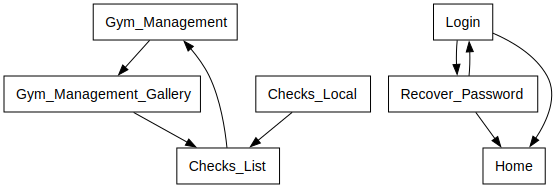

# Power App Documentation \- App\_GymTrend\_Mobile

| Property                   | Value                                   |
| -------------------------- | --------------------------------------- |
| App Name                   | App\_GymTrend\_Mobile                   |
| App Logo                   |  |
| Documentation generated at | Wednesday, April 17, 2024 10:56 AM      |

- [Overview](index-App_GymTrend_Mobile.md)
- [App Details](appdetails-App_GymTrend_Mobile.md)
- [Variables](variables-App_GymTrend_Mobile.md)
- [DataSources](datasources-App_GymTrend_Mobile.md)
- [Resources](resources-App_GymTrend_Mobile.md)
- [Controls](controls-App_GymTrend_Mobile.md)

## Controls Overview

A total of 7 Screens are located in the app.

A total of 90 Controls are located in the app.

### [Screen: Checks\_List](screen-Checks_List-App_GymTrend_Mobile.md)

- [ Checks\_List](screen-Checks_List-App_GymTrend_Mobile.md)
- - [ cnt\_main\_4](screen-Checks_List-App_GymTrend_Mobile.md)
  - - [ cnt\_footer\_4](screen-Checks_List-App_GymTrend_Mobile.md)
    - - [ Footer\_5](screen-Checks_List-App_GymTrend_Mobile.md)
  - - [ cnt\_header\_4](screen-Checks_List-App_GymTrend_Mobile.md)
    - - [ Header\_7](screen-Checks_List-App_GymTrend_Mobile.md)
  - - [ cnt\-body\_4](screen-Checks_List-App_GymTrend_Mobile.md)
    - - [ Gallery3](screen-Checks_List-App_GymTrend_Mobile.md)
      - - [ galleryTemplate3](screen-Checks_List-App_GymTrend_Mobile.md)
      - - [ Icon9](screen-Checks_List-App_GymTrend_Mobile.md)
      - - [ Label7](screen-Checks_List-App_GymTrend_Mobile.md)
      - - [ Toggle1](screen-Checks_List-App_GymTrend_Mobile.md)
- - [ msft\_Button\_2](screen-Checks_List-App_GymTrend_Mobile.md)

### [Screen: Checks\_Local](screen-Checks_Local-App_GymTrend_Mobile.md)

- [ Checks\_Local](screen-Checks_Local-App_GymTrend_Mobile.md)
- - [ cnt\_main\_5](screen-Checks_Local-App_GymTrend_Mobile.md)
  - - [ cnt\_footer\_5](screen-Checks_Local-App_GymTrend_Mobile.md)
    - - [ Footer\_6](screen-Checks_Local-App_GymTrend_Mobile.md)
  - - [ cnt\_header\_5](screen-Checks_Local-App_GymTrend_Mobile.md)
    - - [ Header\_6](screen-Checks_Local-App_GymTrend_Mobile.md)
  - - [ cnt\-body\_5](screen-Checks_Local-App_GymTrend_Mobile.md)
    - - [ Gallery3\_1](screen-Checks_Local-App_GymTrend_Mobile.md)
      - - [ galleryTemplate3\_1](screen-Checks_Local-App_GymTrend_Mobile.md)
      - - [ msft\_Button\_4](screen-Checks_Local-App_GymTrend_Mobile.md)

### [Screen: Gym\_Management](screen-Gym_Management-App_GymTrend_Mobile.md)

- [ Gym\_Management](screen-Gym_Management-App_GymTrend_Mobile.md)
- - [ cnt\_main\_2](screen-Gym_Management-App_GymTrend_Mobile.md)
  - - [ cnt\_footer\_2](screen-Gym_Management-App_GymTrend_Mobile.md)
    - - [ Footer\_3](screen-Gym_Management-App_GymTrend_Mobile.md)
  - - [ cnt\_header\_2](screen-Gym_Management-App_GymTrend_Mobile.md)
    - - [ Header\_9](screen-Gym_Management-App_GymTrend_Mobile.md)
  - - [ cnt\-body\_2](screen-Gym_Management-App_GymTrend_Mobile.md)
    - - [ Camera1](screen-Gym_Management-App_GymTrend_Mobile.md)
    - - [ Icon5](screen-Gym_Management-App_GymTrend_Mobile.md)
    - - [ Icon7](screen-Gym_Management-App_GymTrend_Mobile.md)
    - - [ Image1](screen-Gym_Management-App_GymTrend_Mobile.md)
    - - [ Image7](screen-Gym_Management-App_GymTrend_Mobile.md)
    - - [ Label4\_1](screen-Gym_Management-App_GymTrend_Mobile.md)
- - [ Icon2](screen-Gym_Management-App_GymTrend_Mobile.md)

### [Screen: Gym\_Management\_Gallery](screen-Gym_Management_Gallery-App_GymTrend_Mobile.md)

- [ Gym\_Management\_Gallery](screen-Gym_Management_Gallery-App_GymTrend_Mobile.md)
- - [ cnt\_main\_3](screen-Gym_Management_Gallery-App_GymTrend_Mobile.md)
  - - [ cnt\_footer\_3](screen-Gym_Management_Gallery-App_GymTrend_Mobile.md)
    - - [ Footer\_4](screen-Gym_Management_Gallery-App_GymTrend_Mobile.md)
  - - [ cnt\_header\_3](screen-Gym_Management_Gallery-App_GymTrend_Mobile.md)
    - - [ Header\_8](screen-Gym_Management_Gallery-App_GymTrend_Mobile.md)
  - - [ cnt\-body\_3](screen-Gym_Management_Gallery-App_GymTrend_Mobile.md)
    - - [ Gallery2](screen-Gym_Management_Gallery-App_GymTrend_Mobile.md)
      - - [ Dropdown1](screen-Gym_Management_Gallery-App_GymTrend_Mobile.md)
      - - [ galleryTemplate2](screen-Gym_Management_Gallery-App_GymTrend_Mobile.md)
      - - [ Icon6](screen-Gym_Management_Gallery-App_GymTrend_Mobile.md)
      - - [ Icon8](screen-Gym_Management_Gallery-App_GymTrend_Mobile.md)
      - - [ Img\_Foto](screen-Gym_Management_Gallery-App_GymTrend_Mobile.md)
      - - [ txt\_obs](screen-Gym_Management_Gallery-App_GymTrend_Mobile.md)

### [Screen: Home](screen-Home-App_GymTrend_Mobile.md)

- [ Home](screen-Home-App_GymTrend_Mobile.md)
- - [ cnt\_main](screen-Home-App_GymTrend_Mobile.md)
  - - [ cnt\_footer](screen-Home-App_GymTrend_Mobile.md)
    - - [ Footer\_2](screen-Home-App_GymTrend_Mobile.md)
  - - [ cnt\_header](screen-Home-App_GymTrend_Mobile.md)
    - - [ Header\_10](screen-Home-App_GymTrend_Mobile.md)
  - - [ cnt\-body](screen-Home-App_GymTrend_Mobile.md)
    - - [ Label1](screen-Home-App_GymTrend_Mobile.md)
    - - [ Label2](screen-Home-App_GymTrend_Mobile.md)
- - [ Image14](screen-Home-App_GymTrend_Mobile.md)

### [Screen: Login](screen-Login-App_GymTrend_Mobile.md)

- [ Login](screen-Login-App_GymTrend_Mobile.md)
- - [ 8c98994518b575bfd8c949e91d20548b](screen-Login-App_GymTrend_Mobile.md)
- - [ Button2](screen-Login-App_GymTrend_Mobile.md)
- - [ Image15](screen-Login-App_GymTrend_Mobile.md)
- - [ Mostrar](screen-Login-App_GymTrend_Mobile.md)
- - [ msft\_Button](screen-Login-App_GymTrend_Mobile.md)
- - [ msft\_Label](screen-Login-App_GymTrend_Mobile.md)
- - [ msft\_Label\_1](screen-Login-App_GymTrend_Mobile.md)
- - [ password](screen-Login-App_GymTrend_Mobile.md)
- - [ Tac\_Icon](screen-Login-App_GymTrend_Mobile.md)
- - [ username](screen-Login-App_GymTrend_Mobile.md)
- - [ View](screen-Login-App_GymTrend_Mobile.md)

### [Screen: Recover\_Password](screen-Recover_Password-App_GymTrend_Mobile.md)

- [ Recover\_Password](screen-Recover_Password-App_GymTrend_Mobile.md)
- - [ cnt\_main\_1](screen-Recover_Password-App_GymTrend_Mobile.md)
  - - [ cnt\_footer\_1](screen-Recover_Password-App_GymTrend_Mobile.md)
    - - [ Footer\_1](screen-Recover_Password-App_GymTrend_Mobile.md)
  - - [ cnt\_header\_1](screen-Recover_Password-App_GymTrend_Mobile.md)
    - - [ Header\_1](screen-Recover_Password-App_GymTrend_Mobile.md)
  - - [ cnt\-body\_1](screen-Recover_Password-App_GymTrend_Mobile.md)
    - - [ Label1\_1](screen-Recover_Password-App_GymTrend_Mobile.md)
    - - [ Label4](screen-Recover_Password-App_GymTrend_Mobile.md)
    - - [ password\_1](screen-Recover_Password-App_GymTrend_Mobile.md)
    - - [ password\_2](screen-Recover_Password-App_GymTrend_Mobile.md)
- - [ Label5](screen-Recover_Password-App_GymTrend_Mobile.md)
- - [ Label5\_1](screen-Recover_Password-App_GymTrend_Mobile.md)
- - [ Label6](screen-Recover_Password-App_GymTrend_Mobile.md)
- - [ msft\_Button\_1](screen-Recover_Password-App_GymTrend_Mobile.md)

## Screen Navigation

The following diagram shows the navigation between the different screens.

